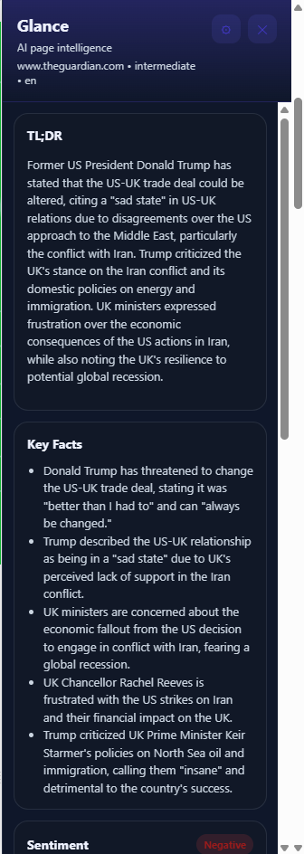
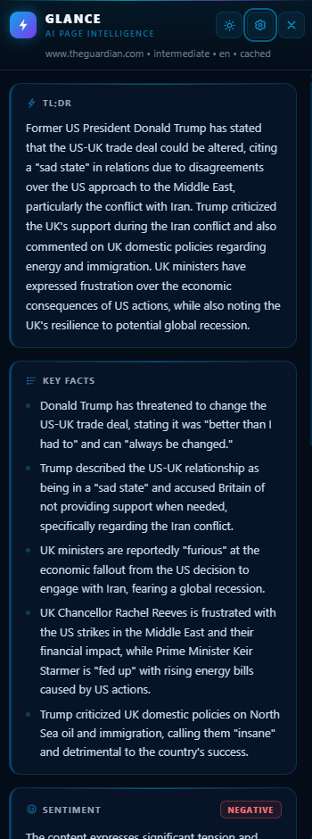
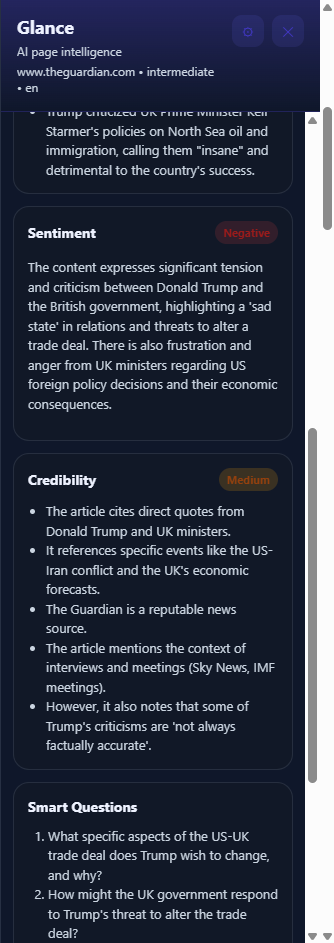
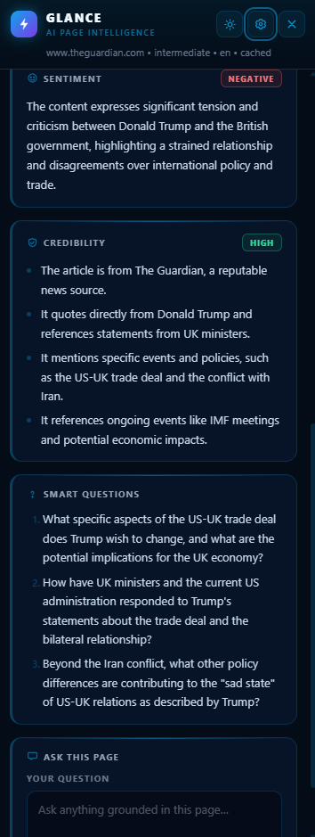
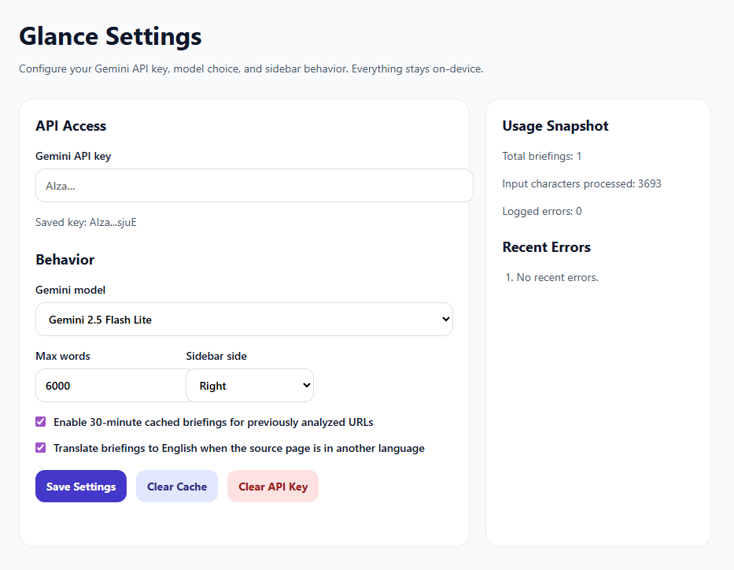
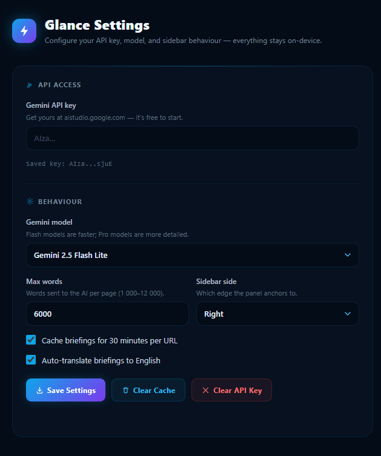
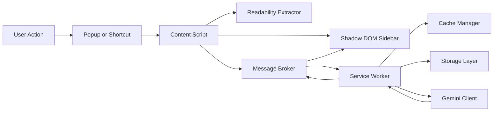

# Glance

Glance is a Manifest V3 Chrome extension that turns the current web page into a structured AI briefing.

It extracts readable page content in the browser, sends that content directly to the Gemini API using the user's own API key, and renders the result in an on-page sidebar. There is no backend. All settings, cache entries, and usage metadata live in `chrome.storage.local`.

## Objective

The objective of this project is to make page triage faster.

Instead of skimming an article, report, product page, or research post manually, Glance gives the user a fast, structured briefing with:

- a concise TL;DR
- five key facts
- sentiment analysis
- credibility signals
- three follow-up questions
- a reading level indicator
- optional grounded Q&A against the current page
- optional selected-text explanation

The product is designed to be:

- client-only
- privacy-aware by default
- fast enough for real browsing
- maintainable as a clean MV3 extension codebase

---

## Demo Video

https://github.com/user-attachments/assets/95fac9a5-12dd-4f7d-a77c-b3b26edc6560

---

## UI Design

The interface was designed and refined using the **`/ui-ux-pro-max`** design intelligence skill, which applies a comprehensive rule set covering accessibility, interaction patterns, typography, color systems, animation timing, and form feedback across 10+ technology stacks.

The design system applied was **dark glassmorphism + AI tool** -deep navy base (`#040c18`), electric cyan (`#0ea5e9`) and violet (`#7c3aed`) accents, card-level left-accent borders for visual hierarchy, SVG icons throughout (no emoji), and a token-driven CSS variable architecture that supports seamless light/dark mode switching with a single button click.

### Sidebar -Before & After

| Before | After |
|:---:|:---:|
|  |  |

### Sidebar Scrolled -Before & After

| Before | After |
|:---:|:---:|
|  |  |

### Settings Page -Before & After

| Before | After |
|:---:|:---:|
|  |  |

### Design Decisions Applied

The `/ui-ux-pro-max` skill was run against the following priorities:

| Priority | Rule Applied | Outcome |
|----------|-------------|---------|
| 1 -Accessibility | `color-contrast`, `aria-labels`, `focus-states` | All icon-only buttons have `aria-label`; focus rings preserved; contrast ≥ 4.5:1 in both themes |
| 2 -Touch & Interaction | `touch-target-size`, `cursor-pointer`, `loading-buttons` | Header buttons are 30×30px with explicit hover states; Ask button disables during API calls |
| 4 -Style Selection | `no-emoji-icons`, `consistency`, `icon-style-consistent` | All icons replaced with consistent 1.5px-stroke SVGs; dark glassmorphism applied uniformly across sidebar, popup, and settings |
| 5 -Layout | `spacing-scale`, `visual-hierarchy` | Panels use 14px gap and 14px/16px padding on a 4pt rhythm; left-border accent (`border-left: 3px`) anchors each card visually |
| 6 -Typography & Color | `color-semantic`, `color-dark-mode`, `weight-hierarchy` | All colors expressed as CSS custom properties (`--g-bg`, `--g-t1`, etc.); `.is-light` class on the root shell overrides every token |
| 7 -Animation | `duration-timing`, `reduced-motion` | Theme transition uses `250ms ease`; skeleton shimmer is `1.7s linear`; both are disabled under `prefers-reduced-motion` |

---

## What The Extension Does

When the user opens Glance on a page:

1. the content script extracts readable text from the current tab
2. the sidebar opens inside the page using a closed Shadow DOM host
3. the content script sends the extracted page snapshot to the background service worker
4. the service worker checks cache and settings
5. the Gemini client makes a structured API call to Gemini
6. the response is normalized and returned to the page
7. the sidebar renders the briefing panels

The extension also supports:

- `Ask This Page`: asks Gemini to answer only from the current page content
- `Highlight & Explain`: explains selected text using surrounding context
- API key management in the options page
- model selection
- local caching
- usage and error stats

## Core Product Decisions

- Chrome Extension standard: Manifest V3
- Build system: Vite with `@crxjs/vite-plugin`
- Language: TypeScript
- Content extraction: `@mozilla/readability`
- Testing: Vitest for unit tests, Playwright for E2E
- Storage: `chrome.storage.local`
- API model: Gemini via direct browser-side extension requests
- UI isolation: injected sidebar with closed Shadow DOM, not an iframe

## Setup

### Prerequisites

- Node.js 24 / npm 11 were used to build and verify this repository locally
- Earlier supported LTS versions may also work, but they are not asserted in `package.json`
- A Gemini API key
- Chrome or Chromium-based browser for loading the unpacked extension

### Install Dependencies

From the project root:

```bash
cd extension
npm install
```

### Generate Icons

Still inside `extension/`:

If you need to regenerate PNG extension icons from the source SVG:

```bash
npm run generate:icons
```

### Build The Extension

Still inside `extension/`:

```bash
npm run build
```

This produces the unpacked extension output in:

```text
extension/dist
```

### Run Tests

Unit tests:

```bash
npm test
```

Coverage:

```bash
npm run test:coverage
```

End-to-end tests:

```bash
npm run test:e2e
```

Current E2E scope is intentionally small: it verifies the options page shell under Playwright. It does not yet automate the full popup -> content script -> sidebar -> service worker flow.

### Load In Chrome

1. Open `chrome://extensions`
2. Enable `Developer mode`
3. Click `Load unpacked`
4. Select `extension/dist`
5. Open the extension options page and add your Gemini API key

## Runtime Usage

### Main Flows

Open the extension:

- click the toolbar action popup and press `Open Glance`
- or use `Alt+P`

Explain selected text:

- highlight text on the page
- right-click and choose `Explain with Glance`
- or use `Alt+E`

### Options Page

The options page allows the user to:

- save or clear the Gemini API key
- choose the Gemini model
- change the max extracted word count
- move the sidebar left or right
- enable or disable caching
- toggle auto-translation-to-English behavior
- clear cache
- inspect basic usage stats and recent errors

## Architecture

### High-Level Flow



### Architectural Responsibilities

#### Content Layer

The content layer runs in the tab and owns page-aware behavior:

- extracting text from the DOM
- opening and closing the sidebar
- handling selected-text explanation requests
- relaying messages to the background worker
- keeping a recent page snapshot in memory for follow-up actions

#### Background Layer

The background layer owns extension-level orchestration:

- command handling
- context menu registration
- cache lookup and writes
- settings lookup
- API key access
- Gemini requests
- error logging
- usage stats

#### Shared Layer

The shared layer exists so that content, background, popup, and options all use:

- the same TypeScript types
- the same storage keys
- the same model list
- the same default settings

### Why Shadow DOM Instead Of An iframe

The project intentionally uses a Shadow DOM sidebar instead of an iframe because:

- it preserves the on-page slide-in UX from the design doc
- it avoids iframe/CSP problems on sites that block embedded frames
- it still provides CSS isolation from host page styles

The implementation uses a closed shadow root to reduce host-page inspection of the sidebar DOM.

### Why The Service Worker Owns Gemini Calls

The background service worker is the right place for Gemini requests because it centralizes:

- API key access
- model validation
- retry logic
- cache logic
- structured response parsing
- logging and stats

That keeps the content script small and avoids scattering sensitive logic around the codebase.

## Security And Privacy Notes

The project includes several deliberate safety choices:

- API keys are stored in `chrome.storage.local`, not in source code
- responses rendered with `innerHTML` are escaped first
- sidebar class names are constrained before interpolation
- Gemini model ids are validated against a known allowlist
- sensitive query params are stripped from cached URLs
- the sidebar uses a closed Shadow DOM host
- the manifest declares a strict extension-page CSP

Important privacy note:

Glance sends page content to Gemini when the user explicitly uses the extension on a page. There is no backend proxy, but page content still leaves the browser and goes to Google's Gemini API.

## What Cursor Did To Build This

The extension was built in stages inside the workspace using the Cursor AI agent. Two skills were central to the process.

### Skills Used

#### `/feature-dev` -Initial Build

The core extension was scaffolded and implemented using the **`/feature-dev`** workflow, which follows a plan-first, implementation-complete approach:

1. Cursor read and interpreted the original `Glance_Design_Document.docx`
2. A full implementation plan was produced covering all MV3 components
3. All to-dos were executed in order without stopping until every component was functional and tested

This skill enforces that planning and execution are separate phases, that no component is left half-built, and that each layer is verified before the next is started.

#### `/ui-ux-pro-max` -UI Redesign

The entire visual layer was redesigned using the **`/ui-ux-pro-max`** skill, a comprehensive design intelligence system containing 50+ UI styles, 161 color palettes, 57 font pairings, 161 product-type reasoning rules, and 99 UX guidelines.

Applied rules included:

- **No emoji icons** -all structural icons replaced with consistent 1.5px-stroke SVGs
- **Token-driven theming** -all colors expressed as CSS custom properties; light/dark toggle persisted to `chrome.storage.local`
- **`openOptionsPage()` routing** -settings navigation routed through the background service worker for MV3 reliability
- **Panel overflow fix** -removed `overflow: hidden` from `.glance-panel` that was clipping content; panels now grow dynamically with content
- **Spacing rhythm** -14px gap between panels, 4pt internal padding scale, visible `3px` left-accent border per card
- **Reduced motion support** -shimmer animation and theme transition both respect `prefers-reduced-motion`

### 1. Read The Design Source

Cursor first extracted and interpreted the original design document and turned it into an implementation plan.

### 2. Reorganized The Repository

The original top-level assets were moved into stable locations:

- `Glance_Design_Document.docx` moved into `docs/`
- `glance_logo.svg` moved into `assets/`

This kept the root clean and made the extension app its own isolated workspace under `extension/`.

### 3. Scaffolded The MV3 Extension

Cursor created:

- the Vite and TypeScript configuration
- the manifest
- the background service worker
- the content script entry point
- the popup
- the options page
- the sidebar renderer

### 4. Implemented The Core Briefing Flow

Cursor wired the main path end to end:

- page extraction
- sidebar injection
- message passing
- Gemini briefing request
- normalized response rendering

### 5. Added Reliability Features

Cursor then added:

- cache manager
- logger
- usage stats
- retry logic
- model fallback behavior
- max word bounds
- defensive error handling across popup, content, and background flows

### 6. Added Power Features

Cursor implemented:

- `Ask This Page`
- `Highlight & Explain`
- context menu support
- keyboard shortcuts

### 7. Hardened The Implementation

During review and verification, Cursor fixed:

- unsafe HTML rendering paths
- message-handling edge cases
- shadow root exposure
- cache normalization issues
- missing error codes
- build/test setup gaps
- background service worker bundle collision (renamed `src/background/index.ts` → `background.ts` to resolve `@crxjs/vite-plugin` ambiguity)

### 8. Verified The Project

After Node and npm became available, Cursor:

1. installed dependencies
2. fixed missing dependency and test-config issues
3. ran the build successfully
4. ran unit tests successfully
5. installed Playwright Chromium
6. ran E2E tests successfully
7. generated the final PNG extension icons from the source SVG

### 9. Redesigned The UI With `/ui-ux-pro-max`

The user requested a futuristic, AI-themed interface. Using the `/ui-ux-pro-max` design skill, Cursor:

1. Applied a dark glassmorphism design system across sidebar, popup, and settings
2. Replaced all emoji-based icons with consistent SVG icons (gear, sun/moon, close, bolt, etc.)
3. Introduced CSS custom property theming (`--g-bg`, `--g-surface`, `--g-t1`, etc.) supporting full light/dark mode via a `.is-light` class toggle
4. Added a working theme toggle button (sun ↔ moon) that persists preference via `chrome.storage.local`
5. Fixed settings navigation by routing `openOptionsPage()` through the background service worker
6. Fixed panel content clipping by removing `overflow: hidden` from `.glance-panel`
7. Increased panel gap from `9px` to `14px` and added a `3px` left-accent border for visual separation
8. Applied skeleton shimmer loading with `prefers-reduced-motion` support
9. Verified build, TypeScript type-check, and linter cleanliness after each change

## Folder And Subfolder Reference

This section describes the purpose of each meaningful folder and subfolder in the repository.

### Root

#### `assets/`

Source assets and reference screenshots.

- `glance_logo.svg`
  - source-of-truth brand artwork
  - used to generate extension PNG icons
- `Glance_before.png` / `Glance_after.png`
  - sidebar UI before and after the `/ui-ux-pro-max` redesign
- `Glance_2_before.png` / `Glance_2_after.png`
  - sidebar scrolled state before and after redesign
- `Settongs_before.png` / `Settongs_after.png`
  - settings page before and after redesign

#### `docs/`

Project documentation inputs.

- `Glance_Design_Document.docx`
  - original design and architecture reference used to build the extension

#### `extension/`

The actual Chrome extension application, toolchain, tests, and build output.

#### `.cursor/`

Cursor workspace metadata and local planning artifacts for the development environment.

#### `.gitignore`

Ignores build artifacts, installed packages, coverage output, and test reports.

### `extension/`

#### `extension/lib/`

Lightweight local wrappers or typed shims around third-party code used by the extension runtime.

- `readability.js`
  - re-exports `@mozilla/readability`
- `readability.d.ts`
  - local typing bridge for the readability import path

#### `extension/public/`

Static assets copied into the extension bundle.

##### `extension/public/icons/`

Extension icon assets.

- `glance_logo.svg`
  - source SVG copied into the extension asset space
- `glance-16.png`
  - 16px toolbar/store icon
- `glance-48.png`
  - 48px icon
- `glance-128.png`
  - 128px icon
- `README.md`
  - explains icon generation and regeneration

#### `extension/scripts/`

Project utility scripts used during development and packaging.

- `generate-icons.mjs`
  - renders `assets/glance_logo.svg` into PNG extension icons using Playwright Chromium

#### `extension/src/`

All authored extension runtime source code.

##### `extension/src/background/`

Service worker code and background-only logic.

- `background.ts`
  - background entry point (renamed from `index.ts` to avoid bundle collision with content script)
  - registers the context menu
  - handles keyboard commands
  - receives runtime messages including `GLANCE_OPEN_OPTIONS`
  - dispatches briefing, ask, explain, and settings-open flows
- `gemini-client.ts`
  - Gemini request construction
  - prompt building
  - structured JSON schema for briefing responses
  - timeout, retry, and fallback logic
- `key-manager.ts`
  - validates, saves, loads, masks, and clears the Gemini API key
- `cache-manager.ts`
  - normalizes URLs
  - strips sensitive query params
  - computes SHA-256 cache keys
  - stores bounded TTL-based briefing cache entries
- `logger.ts`
  - stores compact error records
  - updates usage statistics
  - maintains weekly counters

##### `extension/src/content/`

Tab-side logic that runs on pages.

- `index.ts`
  - content-script entry point
  - owns the open-sidebar flow
  - owns explain-selection flow
  - keeps the latest page snapshot in memory
  - routes settings open via `GLANCE_OPEN_OPTIONS` message to background
- `message-broker.ts`
  - runtime message wrapper between content and background
- `readability-extractor.ts`
  - clones the page
  - runs Readability
  - trims content to configured word limits
  - falls back to body text when needed
- `selection-listener.ts`
  - captures the current text selection and surrounding context
- `sidebar-injector.ts`
  - creates, positions, and removes the sidebar host
  - mounts a closed Shadow DOM root

##### `extension/src/options/`

Options page UI and logic.

- `index.html`
  - settings page markup with dark glassmorphism design, SVG section icons, glass card layout
- `index.ts`
  - settings hydration
  - form submission
  - model dropdown population
  - cache/API-key actions
  - usage/error display with dark-mode compatible status colors
- `options.css`
  - dark theme with CSS custom property tokens, glass cards, scan-line header accent, monospace metric display

##### `extension/src/popup/`

Toolbar popup UI and logic.

- `index.html`
  - popup markup with dark glass shell, animated status dot, gradient primary button
- `index.ts`
  - checks whether a key is configured
  - opens the sidebar on the active tab
  - links to settings
  - manages status dot `is-ready` / `is-error` visual states

##### `extension/src/shared/`

Cross-context shared logic.

- `constants.ts`
  - model list
  - storage keys
  - defaults
  - cache and logging bounds
- `html.ts`
  - HTML escaping helper for safe rendering
- `storage.ts`
  - typed helpers for settings and stats persistence
- `types.ts`
  - canonical TypeScript types for requests, responses, storage, cache, and settings
  - includes `GLANCE_OPEN_OPTIONS` message type

##### `extension/src/sidebar/`

Sidebar rendering system.

- `index.ts`
  - sidebar controller
  - mounts shell markup with inline SVG brand logo
  - provides theme toggle button (sun/moon) wired to `chrome.storage.local`
  - provides settings (gear) and close (×) buttons with SVG icons
  - sets meta state
  - switches between loading, success, error, ask, and tooltip states
- `sidebar.css`
  - token-driven CSS custom property theming (`--g-bg`, `--g-surface`, `--g-t1`, etc.)
  - dark mode defaults; light mode overrides via `.glance-shell.is-light`
  - panels with `3px` left-accent border, `14px` gap, no `overflow: hidden`
  - skeleton shimmer animation with `prefers-reduced-motion` support
  - custom scrollbar, focus rings, and full badge set for both themes

###### `extension/src/sidebar/panels/`

Sidebar content partials.

- `ask-panel.ts`
  - ask form and answer area rendering with inline SVG chat icon
- `briefing-panels.ts`
  - renders TL;DR, key facts, sentiment, credibility, and follow-up questions
  - each panel header includes a dedicated inline SVG icon
- `error-state.ts`
  - renders recovery-oriented sidebar error state with SVG error icon
- `loading-skeleton.ts`
  - renders placeholder loading UI with varied line widths (`wide`, `med`, `short` classes)

##### `extension/src/vite-env.d.ts`

Vite-specific typing support for inline CSS imports.

#### `extension/tests/`

Automated test code.

##### `extension/tests/unit/`

Unit tests run by Vitest.

- `cache-manager.test.ts`
  - validates cache storage and expiry behavior
- `key-manager.test.ts`
  - validates API key handling behavior
- `logger.test.ts`
  - validates error logging behavior

##### `extension/tests/e2e/`

End-to-end tests run by Playwright.

- `sidebar.spec.ts`
  - verifies the options page shell can render under Playwright

##### `extension/tests/setup.ts`

Vitest setup that provides a mock `chrome.storage.local`.

#### `extension/dist/`

Generated unpacked extension output created by `npm run build`.

Important subpaths include:

- `dist/manifest.json`
  - generated production manifest
- `dist/icons/`
  - copied icon assets
- `dist/src/options/`
  - built options page HTML entry
- `dist/src/popup/`
  - built popup HTML entry
- `dist/assets/`
  - bundled JavaScript and CSS chunks
- `dist/service-worker-loader.js`
  - service worker loader emitted by the extension build pipeline

This folder is generated and should not be manually edited.

#### `extension/node_modules/`

Installed dependencies. This is generated by `npm install` and should not be edited manually.

#### Root Files Inside `extension/`

- `package.json`
  - scripts and dependencies
- `tsconfig.json`
  - strict TypeScript configuration
- `vite.config.ts`
  - Vite + CRX + Vitest configuration
- `manifest.config.ts`
  - source manifest definition used by the CRX plugin; references `background.ts` entry point
- `manifest.json`
  - local static manifest reference
- `playwright.config.ts`
  - Playwright test configuration

## Commands Reference

From `extension/`:

```bash
npm install
npm run generate:icons
npm run build
npm test
npm run test:coverage
npm run test:e2e
```

## Verified Status

At the time this README was written, the following had been verified successfully:

- dependency installation
- extension build
- unit tests
- end-to-end tests for the current Playwright scope, which is the options page shell rather than the full extension runtime flow
- icon generation
- lint/diagnostic cleanliness in the editor
- theme toggle (light/dark) with persisted preference
- settings page opening via background service worker routing
- panel content rendering without overflow clipping

## Future Improvements

The current implementation is strong enough for unpacked use and iteration, but natural next improvements would be:

- demo video recording and embedding in this README
- richer E2E coverage for the full extension flow
- additional tests around message passing and service-worker restarts
- privacy messaging for users before page content is sent to Gemini
- a publish checklist for Chrome Web Store submission
- optional font loading (Inter or similar) for the sidebar to improve typography
- keyboard shortcut to toggle light/dark mode without opening the sidebar
